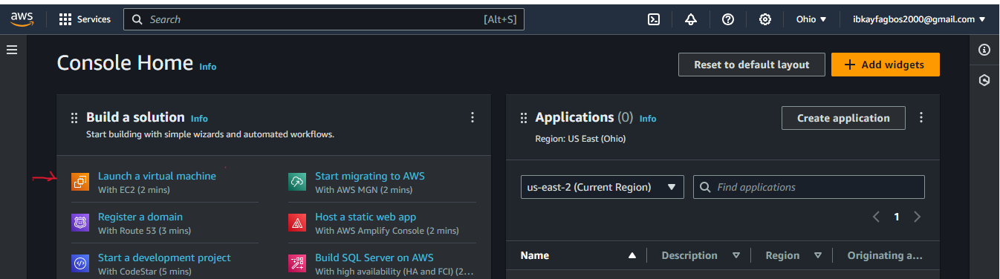

# LAMP STACK

## Lamp Stack Implementation

### INTRODUCTION TO LAMP STACK

### A LAMP stack is a bundle of four different software technologies that developers use to build websites and web applications.

### LAMP is an acronyms for the operating system.

### Linux
### Apache 
### MySQL
### The database server
### Web Server
### Programming language, PHP.

### You may have heard something about the LAMP stack. That wouldn’t be surprising, since some of today’s most popular open source web applications—for example, WordPress and Drupal—all run on LAMP.

### But LAMP has a lot more to its credit. It was one of the first open source software stacks for the web and remains one of the most common ways to deliver web applications.
###  It is so widely used that you are likely to encounter it frequently during your career as you update or host existing applications. And it is considered by many to be the platform of choice for developing new custom web apps. Stable, simple, powerful—these are words most often used to describe LAMP. All of this makes it well worth learning about and a valuable addition to any developer’s resume.

## LAMP STACK COMPONENT

### Linux: The operating system. Linux is a free and open source operating system (OS), Linux is popular in part because it offers more flexibility and configuration options than some other operating systems.
### Apache: The web server. The Apache web server processes requests and serves up web assets via HTTP so that the application is accessible to anyone in the public domain over a simple web URL. Apache is a mature, feature-rich server that runs a large share of the websites currently on the internet.
### MySQL: The database MySQL is an open source relational database management system for storing application data. With My SQL, you can store all your information in a format that is easily queried with the SQL language. SQL is a great choice if you are dealing with a business domain that is well structured, and you want to translate that structure into the backend. MySQL is suitable for running even large and complex sites. 
### PHP: The programming language The PHP open source scripting language works with Apache to help you create dynamic web pages. You cannot use HTML to perform dynamic processes such as pulling data out of a database. To provide this type of functionality, you simply drop PHP code into the parts of a page that you want to be dynamic. PHP is designed for efficiency. It makes programming easier—and a bit more fun—by allowing you to write new code, hit refresh, and immediately see the resulting changes without the need for compiling.

### LAMP uses Linux as the OS, you can use the other components with an alternative OS to meet your specific needs. For example, there is a WAMP stack, which uses Microsoft Windows MAMP with the Mac OS; and even WIMP, using Windows and the Internet Information Services webserver from Microsoft.

## ADVANTAGES OF LAMP
### 1.	LAMP is all open source and non-proprietary, you can avoid lock-in.
### 2.	LAMP secure architecture and well-established encryption practices that have been proven in the enterprise.
### 3.	LAMP offers flexibility in other ways as well. 

## Targeted Audience   

### Targeted audience of Lamp stack are developers, they use Lamp stack to create, host and maintaining web content . This is the back bone of most of the website we use today.

##  Prerequisite

### Learner should install and know Linux
### Installing Apache
### Installing MySQL.
### Installing PHP.
### Creating a Virtual Host for your Website.
### Testing PHP Processing on your Web Server

### Goal to be accomplished by the end of the project

### 1.  At the end of this program, learner should have enough confidence on Linux Terminal.
### 2. Basic Knowledge of AWS platform and how to create instance as well as component of use to host website of various web stack.
### 3. Learner should have deeper understanding on web stack and different between web technology

### [SIDE SELF STUDY IN GOOGLE WORD  DOCUMENTATION] 
### `(https://docs.google.com/document/d/1MgGS4rry6Tpnm_d_mol9d9Xe3RMNYyKTYQBPER0d6vE/edit)`

# Preparing Prerequisite
## Step 0
## Create Aws account

### Log into Aws website
### Subscribe for free tier.
### Enter your detail, email, Name
### Confirm your your password to be used with the new created account
### Press create amazon account
### Provide payment information on your $ card.
### Check your mail for confirmation and activation code.
### Login into your created account and select the region closer to you.

### Lunch a new EC2 (Elastic Computer Cloud).

### Lunch a new instance of t2.micro family with Ubuntu server by using Ubuntu 20.04 LTS (HVM).
### On the EC2 Dashboard, choose Launch and click lunch instance.

### Under Name and tags, for Name, enter a name you wan t to give your instance like my First instance 
### Application and OS Images, choose an AMI that meets your web server.
### Under Instance type, for Instance type, select an instance type that meets your web server needs.
### Edit inbound security group.

### Generate a PEM KEY and save it.
### This PEM key will be use to connect to our EC2 instance via ssh.
### We can open a window terminal or git hub terminal of our choice.

### Name the PEM KEY and save it.
### Connect to the instance by running below code.
### `ssh -i <private-key-name>.pem ubuntu@<Public-IP-address>`

### Change the directory to where we saved our PEM KEY
### Run cd downloads press enter
### Run ls to see our key inside Downloads
### Change permission for the private-key name 
### `sudo chmod 0400 <private-key-name>.pem`
### Connect to instance on the terminal with below  code 

### `ssh -i <private-key-name>.pem ubuntu@<Public-IP-address>`
### With this we just created our first Linux server

### Remember when not in used STOP YOUR INSTANCE OR TERMINATE TOTTALLY WHEN YOU ARE DONE WITH YOUR PROJECT.
### You can start your instance any time you want but put in miond that  different IP address.

## STEP 1
### INSTALLING THE APACHE AND UPDATING THE FIREWALL

### install apache using Ubuntu's package manager.
### update a list of packages in package manager
### `$ sudo apt update`.

### run `apache2 package installation`
### `$ sudo apt install apache2`

### To ensure apache is working on our OS run below command
### `$ sudo systemctl status apache2`

### If its green its means its running properly.
### On our instance add inbound rule by edit our configuration connecting to port 80 and save our change.

### `$ curl http://localhost:80` this via DNS name or
### `$ curl http://127.0.0.1:80`this is IP address

### Input below on any browser and put below address
### (http://<Public-IP-Address>:80)
### We will see the APACHE DEFAULT APACHE DEFAULT PAGE.

## STEP 2
### INSTALLING MYSQL
### Mysql help us in our data base mangement.
### On our terminal run below code.
### `$ sudo apt install mysql-server`.

### After installation, confirm your installation by typing Yes and Press Enter.
### Then Log into MYSQL by running below instruction.

### `$ sudo mysql`.

### This code will connect with MYSQL server and run as administrator root users by running sudo command.
### We shuold have below result
### Welcome to the MySQL monitor. Commands end with ; or \g.
### Your MySQL connection id is 11
### Server version: 8.0.22-0ubuntu0.20.04.3 (Ubuntu)

### Copyright (c) 2000, 2020, Oracle and/or its affiliates. All rights reserved.

### Oracle is a registered trademark of Oracle Corporation and/or its affiliates. Other names may be trademarks of their respective owners.

### Type 'help;' or '\h' for help. Type '\c' to clear the current input statement.
### `mysql>` 

### Then run Security script that comes with pre installed MYSQL by running below code, and set a password as a root users

### `ALTER USER 'root'@'localhost' IDENTIFIED WITH mysql_native_password BY 'PassWord.1';`

### `password as mysql_native_password`
### We can then Exit MYSQL with below code.
### `mysql> exit`.

### Now we shall begin an interactive scrip by running below code, which will ask if want to configure THE VALIDATED PASSWORD
### `$ sudo mysql_secure_installation`.

### If this is enable, password may be rejected by mysql and come back with error message.
### So it is safe to leave it disable.
### To test the VALIDATE PASSWORD PLUGIN, press Y or other key to say No.
### We can now test if we can  log into MYSQL console with below code 
### `$ sudo mysql -p`.

### **NOTE** You need to provide password to connect to root users.
### MYSQL server is now installed and secured.

[text](Images/desktop.ini)

## STAGE 3
### INSTALLING PHP
### We have installed Apache to serve our content
### We installed mysql to store & manage our data
### Now we need to install PHP, which is a set up component that process code to display dynamically to the end users
### Also we will install Php-mysql this is a module that allows PHP to communicate with MYSQL database
### In addition we will also install libapache2-mod-php, this enable pHP to handle apache files.
### These 3 packages can be installed at a go with below code, run,
### `$ sudo apt install php libapache2-mod-php php-mysql`.

### After installation, we can run PHP-v to check for PHP version, we will see something like this.
### PHP 7.4.3 (cli) (built: Oct  6 2020 15:47:56) ( NTS )
### Copyright (c) The PHP Group
### Zend Engine v3.4.0, Copyright (c) Zend Technologies.

### At this point we can boldly say that our lamp Stack is completely installed and fully operational comprises of Linux (Ubuntu), Apache http sever, Mysql and PHP.
[text](Images/desktop.ini)

## STEP 4
### ENABLE PHP ON THE WEBSITE
### Incase we want to change PHP behavior, we willchange the order of index.php file in the directory.
### Run below code 
### `sudo vim /etc/apache2/mods-enabled/dir.conf`.

### `<IfModule mod_dir.c>` .

### Change this:   
`#DirectoryIndex index.html index.cgi index.pl index.php index.xhtml index.htm`
### To this: 
`DirectoryIndex index.php index.html index.cgi index.pl
 index.xhtml index.htm 
 </IfModule>`.

### We can save and close the file then reload apache to see that the change edited has taken place. Run below code
### `$ sudo systemctl reload apache2`.

### Now create a new file called index.php 
### Run below code
### `$ vim /var/www/projectlamp/index.php`.

### Then you see something like this, save and close a file.
### `<?php`
### `phpinfo();`

### Check below on your browser, if you can see this page on your browser, that means PHP has been installed successfully.

## CREATING VIRTUAL HOST FOR MY WEBSITE USING APACHE.
### We are going to setup a domain called project Lamp
### Create directory for project 1 by using below code
### `$ sudo mkdir /var/www/projectlamp`.

### Then assign ownership of the directory with the $USERS enviroment that will refrence your current system users
### Run below code 
### `$ sudo chown -R $USER:$USER /var/www/projectlamp`.
### The output will look like this

### We can now create and open a new configuration file in apache's site-avaible using prefered command- line editor.
### We can either use Vi or Vim
### Run below code
### `$ sudo vi /etc/apache2/sites-available/projectlamp.conf`.

### A new blank file is created , by clicking i, we can now paste the following information on it 
`<VirtualHost *:80>
ServerName projectlamp
ServerAlias www.projectlamp 
ServerAdmin webmaster@localhost
DocumentRoot /var/www/projectlamp
ErrorLog ${APACHE_LOG_DIR}/error.log
CustomLog ${APACHE_LOG_DIR}/access.log combined
</VirtualHost>`

### Then save and close the file by click esc, :, wq, w(write) q(quit) click enter.

### Use ls command to show new file in the sites-available

### We can now enable our new virtual host with by running below code
### `$ sudo a2ensite projectlamp`

### To disable apache defaul configuration so that it does not overite our virtual host.
### Run below code
### `$ sudo a2dissite 000-defaul`

### Then ensure our configuration does not contain syntax error.

### Then reload apache to ensure our change has taken effect.
### Run below command
### `$ sudo systemctl reload apache2`.

### Our new website is now working but the web root is still empty. So we can bow create an index.htlm file in that location so as to ensure and test our virtual host is working as espected. On the terminal, echo hello Lamp and check if it can be seen on our url. 

### Now we can now go to our instance copy our public IP and put on open website url and paste an IP address.
###  `http://<Public-IP-Address>:80`

 

### At this stage we can leave our file as temporary landing page for our application until we set up an index php file to replace it.

### Side self learning
### `https://github.com/IBK-DevOPs/Lamp-stack-.git`

